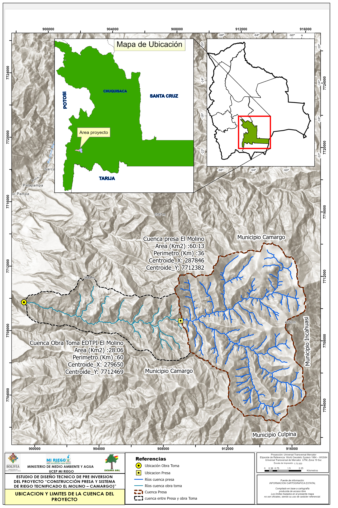

## Welcome

This site presents hydrological calculations and analyses for reservoir operations, water balance assessments, and flow dynamics. The analyses combine Python-based computational methods with interactive visualizations to support water resource management decisions.

{#fig-ubic_ fig-align="center"}

## Featured Analyses

### Reservoir Operations
Comprehensive operational analysis including storage dynamics, inflow-outflow relationships, and water level forecasting using historical data and hydrological models.

[View Analysis →](erosion-El_Molino_T2-D1.ipynb)

### Water Balance
Detailed water balance calculations accounting for precipitation, evapotranspiration, surface runoff, and groundwater interactions across the watershed.

### Flow Analysis
Statistical analysis of flow regimes, flood frequency analysis, and low-flow characteristics for water availability assessment.



## Methodology Overview

The analyses employ:

- **Hydrological modeling**: Rainfall-runoff transformation using empirical methods
- **Time series analysis**: Trend detection and seasonal decomposition
- **Uncertainty quantification**: Monte Carlo simulations for reservoir operations
- **Spatial analysis**: GIS-based watershed delineation and land use assessment

## Tools & Methods

This work utilizes:

- **Python** for data processing and analysis (pandas, numpy, scipy)
- **Plotly** for interactive visualizations
- **Hydrological models** for reservoir simulation and forecasting
- **Statistical methods** for frequency analysis and trend detection

## About

These analyses support evidence-based decision-making in water resource management, combining field data with computational hydrology and hydrogeology principles.

---
